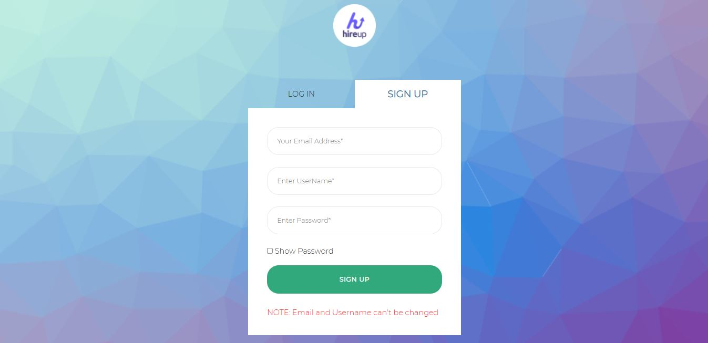
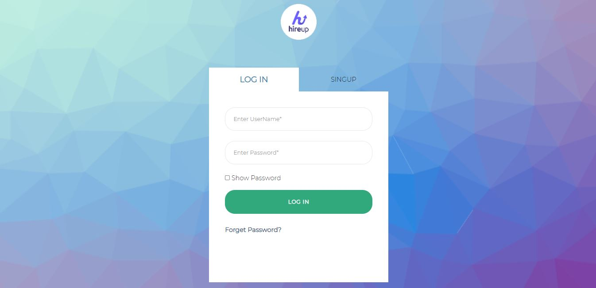
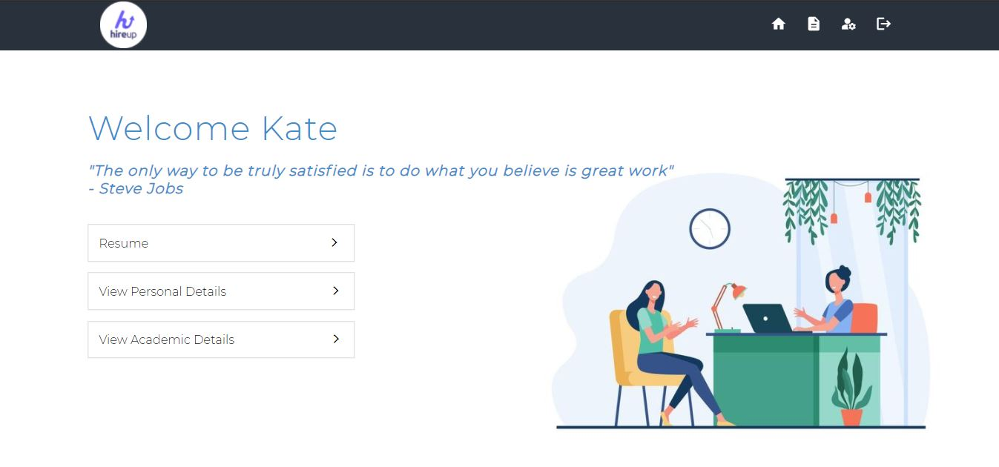
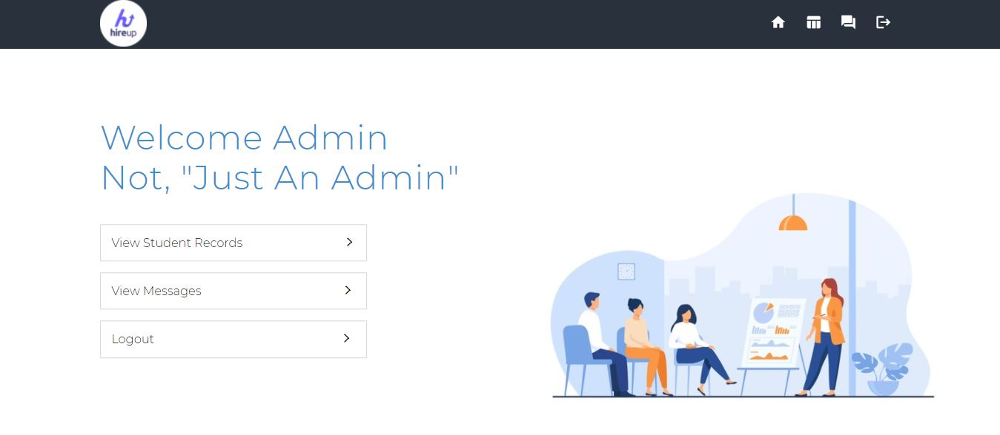
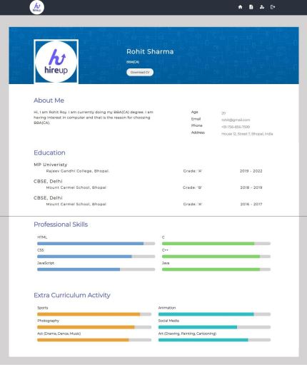

# Hi, I'm Ashish! 👋

# Intern & HireUp (Java Full Stack Project)

A brief description of what this project does and who it's for...

The Project named Intern & HireUp is developed as an attempt to take personal,
academic and skills records of student and making it available for the college
administrator. The system provide the facility of viewing personal, academic and skills
details of the student as well as generated resume for college administrator. It also
provides the facility to search for student records and print reports.

The application, as described above, can lead to error free, secure, reliable and
fast management of the data. It can assist the user to concentrate on their other activities
rather to concentrate on the record keeping. Thus it helps organization in better
utilization of resources. The organization can maintain computerized records without
redundant entries. That means that one need not be distracted by information that is not
relevant, while being able to reach the information

## Tech Stack

**Front-end:** HTML, CSS, JavaScript

**Server:** JSP

**Back-end:** MySQL

## 	:camera: Screenshots

## :scroll: Lessons Learned

No matter what type of project you are building or working on, the experience and the knowledge you gain from it cannot be measure.
Some of the thing that I learned while building this project is that creating a project is not a one day task and you need to be consistent.
Keep building, converting and enjoying the process of tranfering the idea into anobject.
Aslo note that mistakes are their to happen, but you should not shy from it, note it, analysed it, and learned from it. This could prevent it from happening again.

Some of main lession I learned:
- Start with a plan, Brainstorm and not just directly jump on it.
- If its a large projects, then divide it into modules.
- Make prototype / Wireframe of your idea/module. This will prevent any future problem and save time.
- Document as you build and not postponed it to the end.

# "Build, make mistake, learned from it and build again."

## 🚀 About Me
I'm a full stack developer, I like learning and givign my ideas a wings to fly. <a href="https://github.com/Afirestriker">Explore</a> to know more about me

